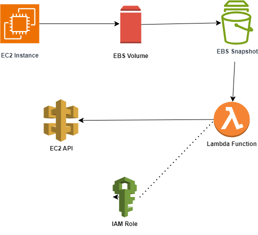
## Lambda Function to Delete Idle EBS Snapshots for Cost Optimization
**Scenario:**

Effectively managing cloud costs is crucial for any organization utilizing AWS (Amazon Web Services). A key strategy for cost optimization involves identifying and eliminating unused resources.

In an AWS environment, it is common to have multiple EBS snapshots taken for backup or disaster recovery purposes. Over time, some of these snapshots might become idle and no longer necessary, especially if the associated EBS volumes are no longer attached to any EC2 instance. To optimize costs, we’ll create a Lambda function that automatically finds and deletes these idle snapshots, helping you manage your AWS expenses more efficiently.

**Objective:**
Create an AWS Lambda function that automatically deletes EBS snapshots if their associated EBS volumes are not attached to any EC2 instance.

### Prerequisites
Before you start with the project, ensure you have the following prerequisites in place:

- **AWS Account**: With permissions to manage Lambda, EBS snapshots, and EC2 instances.
- **AWS CLI**: Installed and configured on your machine.
- **Basic IAM Understanding**: To create roles and custom policies.
- **Basic AWS Lambda Knowledge**: To create and deploy the function.
- **Python Knowledge**: Since the Lambda function will be in Python.
- **Boto3 Library**: Familiarity, as it will be used for AWS service interactions.

##

### Create an EC2 Instance
This instance will serve as a resource to interact with during the setup of our Lambda function.

Note that this step can also be automated using Terraform, but for the sake of simplicity we will create it manually on the console.

When creating the ec2 instance a 8gib EBS Volume is automatically attached, this volume we will use to create a snapshot.

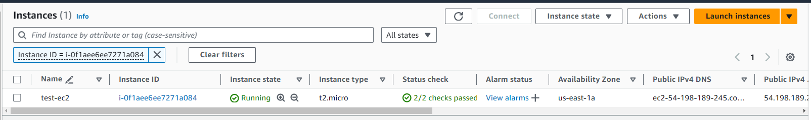

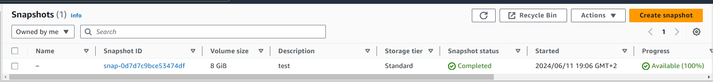

### Creating Snapshots of the Volume
Currently we don’t have any snapshots available for our instance.

To confirm this navigate to the EC2 Dashboard by searching for “EC2” in the services menu.

Find the “Snapshots” section in the left-hand menu and click on it.

- To create a snapshot of the instance click on the “Create Snapshot” button.
- Choose the EBS volume for which you want to create a snapshot from the dropdown menu.
- Optionally, add a description for the snapshot to provide more context.

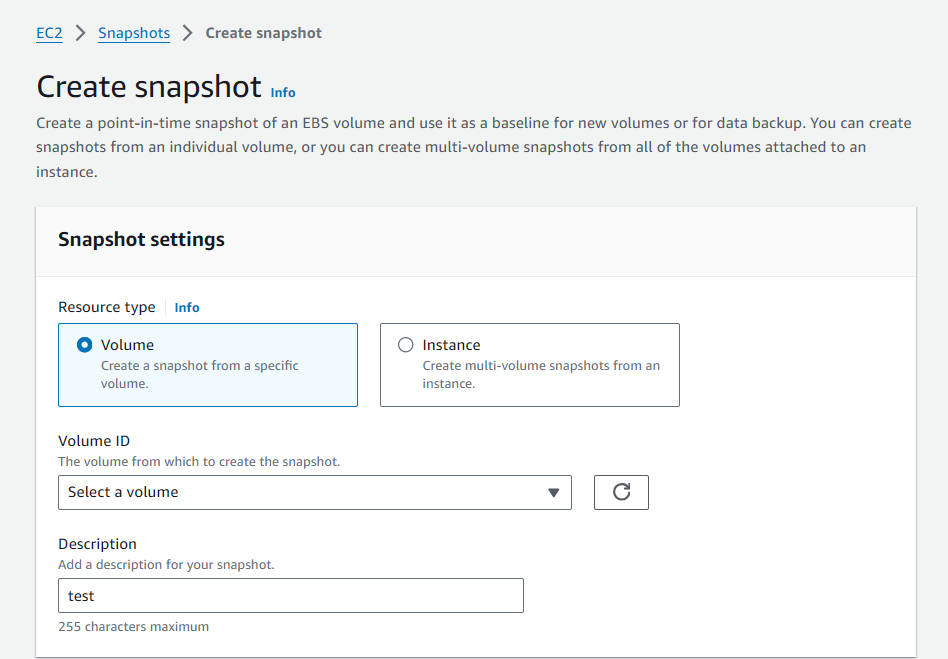

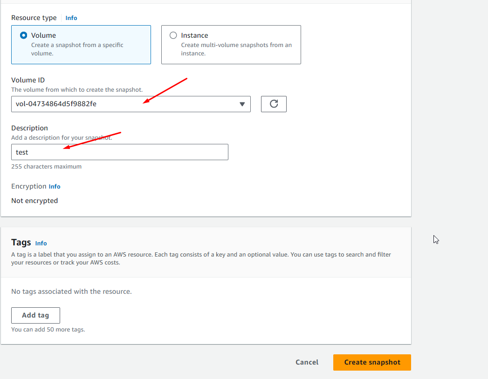


### AWS Lambda
Creating an AWS Lambda function allows you to execute code in response to events without provisioning or managing servers.

In our project, we aim to automate the identification and deletion of stale EBS snapshots using an AWS Lambda function.

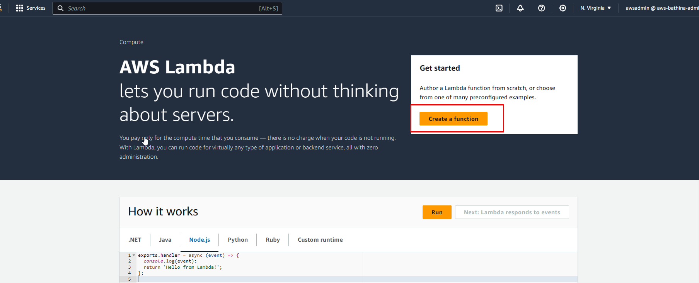

**Choose Authoring Method:**

- Select “Author from scratch” to create a new Lambda function from scratch.

**Configure Basic Information:**

- Provide a meaningful name for your Lambda function.
- Select the runtime environment. Since we’re using Python, choose “Python 3.12”.

**Edit Configuration**

- Navigate to the “configuration tab” of the created Lambda function and click “Edit”.
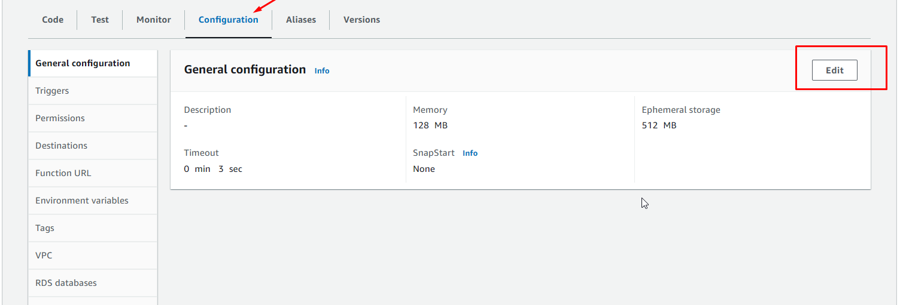

- Look for the section where you can adjust the function timeout.
- By default, the timeout is set to “3 seconds”. Change this to “10 seconds”.
- This value represents the maximum amount of time (in seconds) that Lambda will allow the function to run before terminating it.

- It is good practice to keep the execution time as small as possible since AWS will charge you using this as one of the parameters.
Click “Save” to apply the changes.

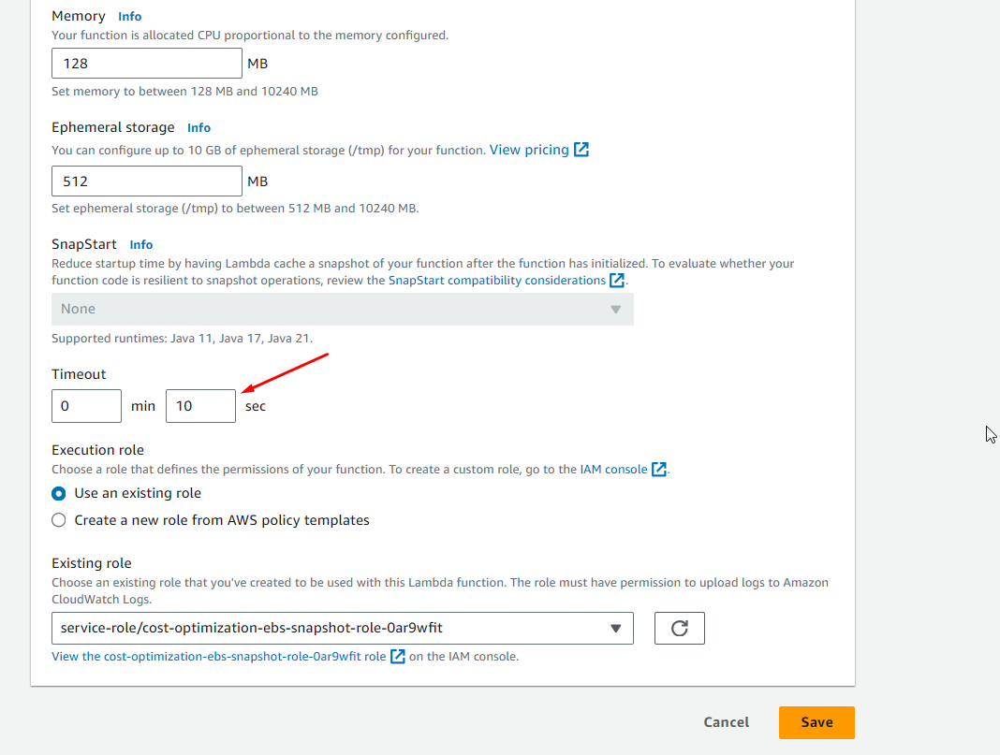

## IAM Role
In our project, the Lambda function is central to optimizing AWS costs by identifying and deleting stale EBS snapshots.

To accomplish this, it requires specific permissions. These include the ability to describe and delete snapshots, as well as to describe volumes and instances.

Roles are used to delegate access to AWS resources securely, without the need to share long-term credentials like access keys.

To achieve this follow these step by step guide below:

- In the Lambda function details page, click on the “Configuration” tab.
- Scroll down to the “Permissions” section to expand it.
- Click on the execution role link to open the IAM role configuration in a new tab.

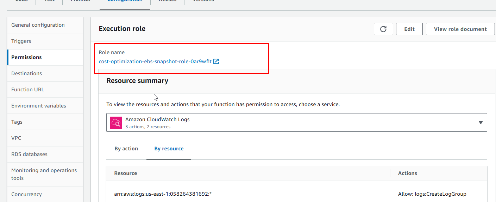

- In the new tab that opens, you’ll be directed to the IAM Console with the details of the IAM role associated with your Lambda function.
- Scroll down to the “Permissions” section of the IAM role details page.
- Click on the “Add inline policy” button to create a new inline policy.

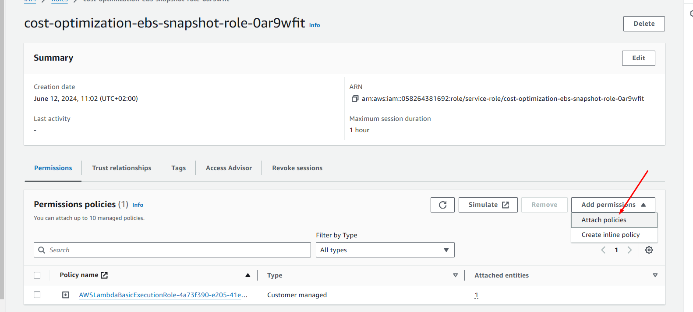

- Choose services as EC2 filter permissions.
- Search “Snapshot” and add these options **“DescribeSnapshots”**, **“Delete Snapshots”**.
- Also add these permissions as well **“Describe Volume”**, and **“Describe Instances”**.

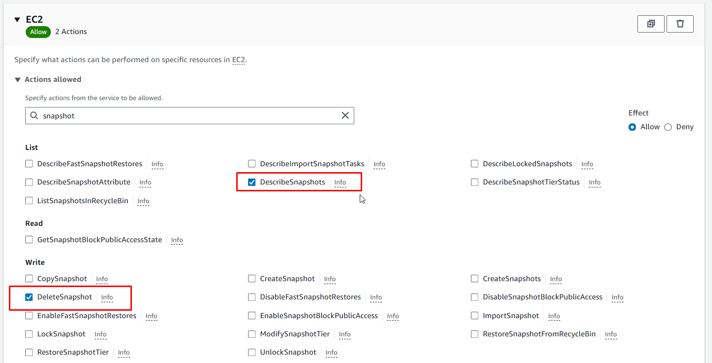

Give the name of the policy then click the “Create Policy” button.

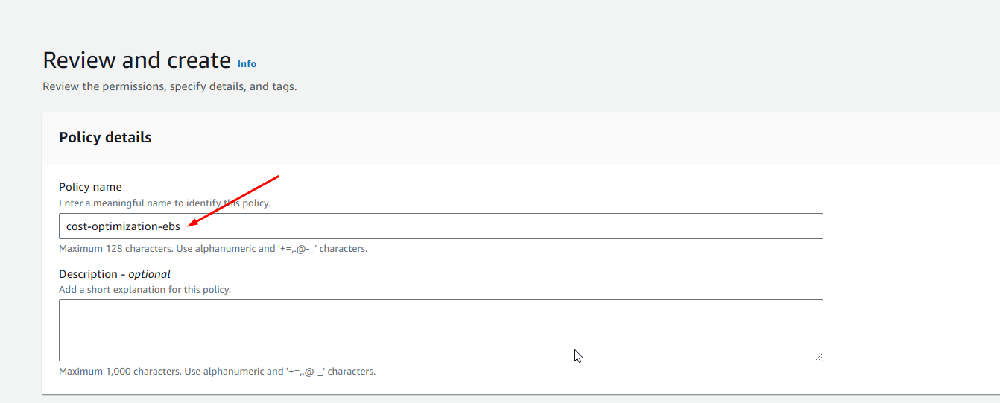

Make sure that the created policy is attached to the existing role.

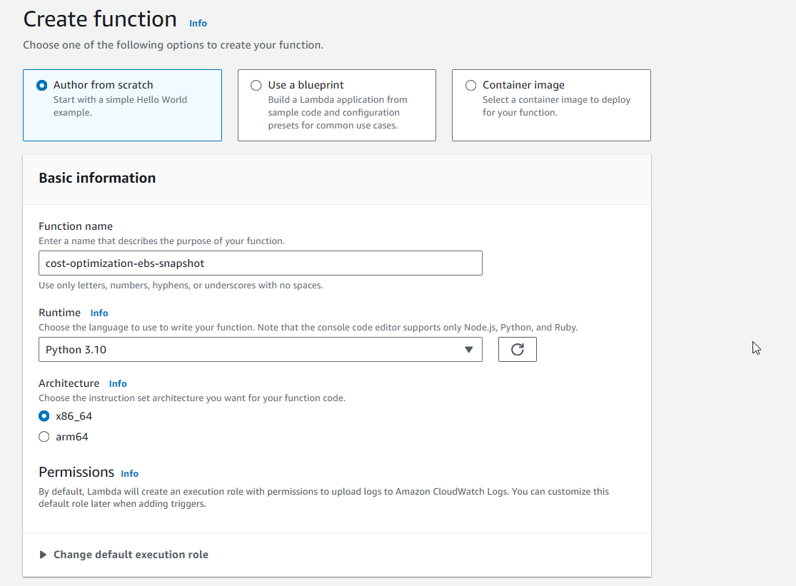

## Writing the Lambda Function
Our Lambda function, powered by Boto3, automates the identification and deletion of stale EBS snapshots. Key features include:

1. **Snapshot Retrieval**: Fetching owned EBS snapshots and active EC2 instances.
2.  **Stale Snapshot Detection**: Identifying unattached snapshots and checking volume-attachment status.
3.  **Exception Handling**: Ensuring robustness with error management.
4.  **Cost Optimization**: Efficiently managing resources to minimize storage costs.

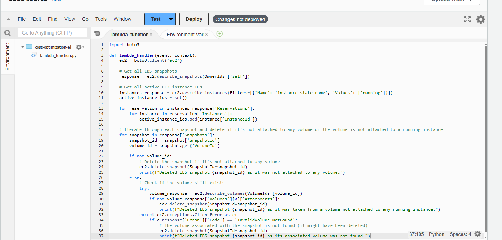

```
import boto3

def lambda_handler(event, context):
    ec2 = boto3.client('ec2')

    # Get all EBS snapshots
    response = ec2.describe_snapshots(OwnerIds=['self'])

    # Get all active EC2 instance IDs
    instances_response = ec2.describe_instances(Filters=[{'Name': 'instance-state-name', 'Values': ['running']}])
    active_instance_ids = set()

    for reservation in instances_response['Reservations']:
        for instance in reservation['Instances']:
            active_instance_ids.add(instance['InstanceId'])

    # Iterate through each snapshot and delete if it's not attached to any volume or the volume is not attached to a running instance
    for snapshot in response['Snapshots']:
        snapshot_id = snapshot['SnapshotId']
        volume_id = snapshot.get('VolumeId')

        if not volume_id:
            # Delete the snapshot if it's not attached to any volume
            ec2.delete_snapshot(SnapshotId=snapshot_id)
            print(f"Deleted EBS snapshot {snapshot_id} as it was not attached to any volume.")
        else:
            # Check if the volume still exists
            try:
                volume_response = ec2.describe_volumes(VolumeIds=[volume_id])
                if not volume_response['Volumes'][0]['Attachments']:
                    ec2.delete_snapshot(SnapshotId=snapshot_id)
                    print(f"Deleted EBS snapshot {snapshot_id} as it was taken from a volume not attached to any running instance.")
            except ec2.exceptions.ClientError as e:
                if e.response['Error']['Code'] == 'InvalidVolume.NotFound':
                    # The volume associated with the snapshot is not found (it might have been deleted)
                    ec2.delete_snapshot(SnapshotId=snapshot_id)
                    print(f"Deleted EBS snapshot {snapshot_id} as its associated volume was not found.")
```


### Testing the Lambda Function
To simulate a real-world scenario, delete the existing EC2 instance.

When an EC2 instance is deleted, AWS automatically removes the attached EBS volume as shown below.

However, any EBS snapshots associated with that volume remain in storage, even though they are no longer needed.

These snapshots, termed ‘idle,’ incur additional storage costs without serving any purpose.

Therefore, it’s crucial to regularly identify and remove such stale snapshots to optimize AWS storage costs effectively.

Once the Instance is deleted we can observe whether our Lambda function successfully identifies and removes any associated snapshots.

Follow the below steps:

- Navigate to the created EC2 instance and terminate it.
- Navigate to the created Lambda Function.
- Under the “Code” section in “lambda_function” paste the above - - - Python code for your Lambda function.
- Ensure that your code includes necessary imports (e.g., import boto3) and the lambda_handler function.

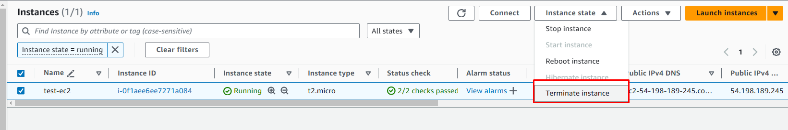

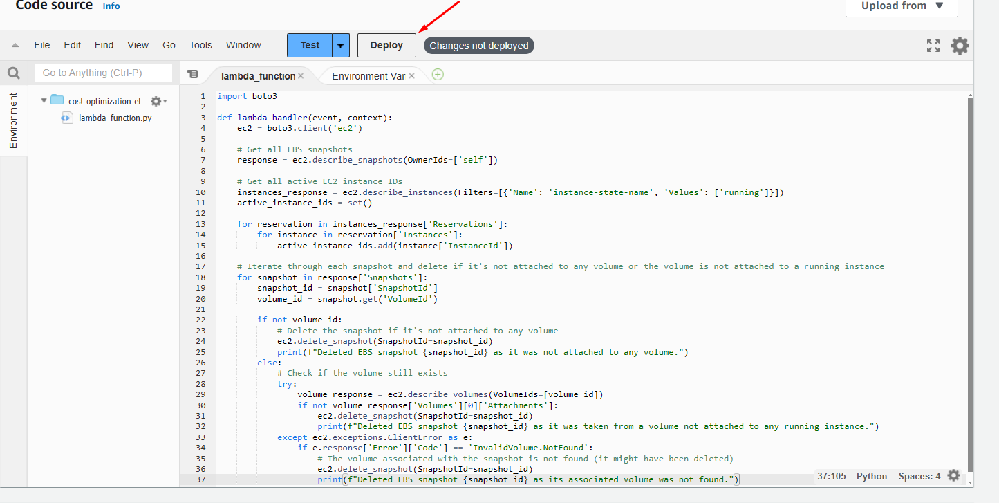

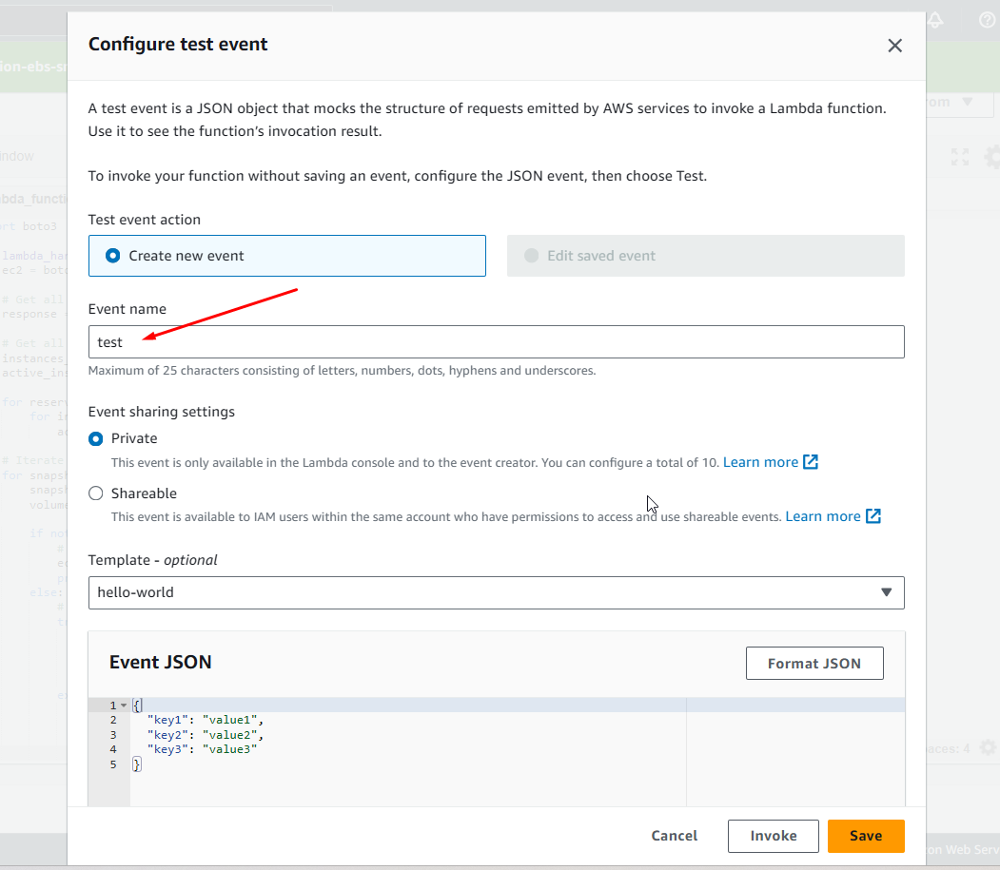

- Save your Lambda Function to test it click on the “Test” Button.
- After running the test, review the output and logs to ensure that your function executed as expected.
- Debug any errors or issues that may arise during testing.


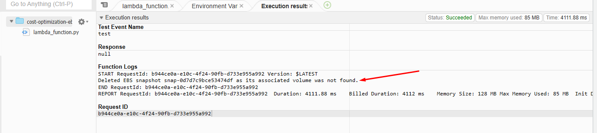


- Once your function passes testing, you can deploy it by clicking on the “Deploy” button.

The Lambda function automatically finds and deletes these stale snapshots, helping you manage your AWS expenses more efficiently.

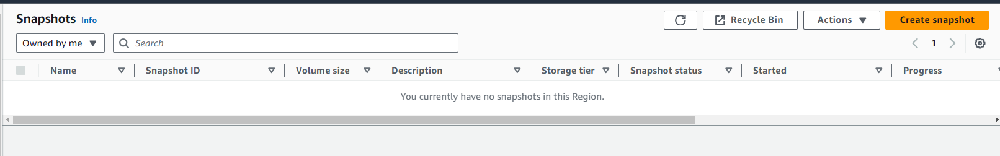

After deployment, monitor the execution of your Lambda function in the AWS Lambda console. Use CloudWatch Logs to view detailed logs and metrics for your function. You can also use EventBridge for automated and scheduled triggering of your Lambda function to ensure it runs at your desired intervals.

### Conclusion

In this project, we’ve implemented a solution to automate the identification and deletion of stale EBS snapshots, leveraging AWS Lambda and Boto3.

By optimizing storage usage, we’ve reduced costs and improved resource efficiency.

This project demonstrates the effectiveness of automation in driving cost optimization within AWS, setting the stage for continued success in cloud management endeavors. By adopting similar strategies, you can ensure that your AWS environment remains cost-effective and efficient, freeing up resources for more critical tasks.

## END!!


